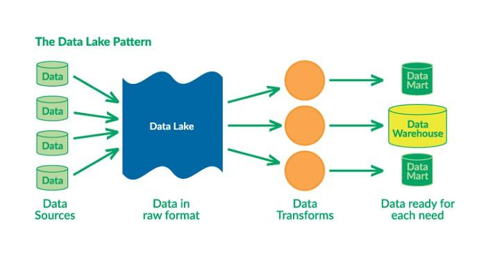

# Lecture 8: Data Management

Recall overview from Lesson 6 about MLOps Iinfrastructure!

[TOC]

## Data Sources
- Public datasets
  - provide no competitive advantage
- Private dataset
  - Label yourself (see below)
  - Label from users ("data flywheel") - see product design and 
  - No Labels, but use semi-supervised learning
    - for text, predict future words from past words (or similar), e.g. BERT ?!
    - for image, see [SEER](https://ai.facebook.com/blog/seer-the-start-of-a-more-powerful-flexible-and-accessible-era-for-computer-vision), achieving state-of-the-art ImageNet accuracy
- Augment your existing data
  - For tabular data, you can delete some cells to simulate missing data.
  - For text, there are no well-established techniques, but you can replace words with synonyms and change the order of things.
  - For speech and video, you can change speed, insert a pause, mix different sequences, and more.
- Synthetic data
  - examples in self-driving car, but also e.g. 3D-animated wrinkled receipts

## Data Storage
Building blocks

### Filesystem
Foundational layer of storage.

- Its fundamental unit is a “file” — which can be text or binary, is not versioned, and is easily overwritten.
- A file system can be as simple as a locally mounted disk containing all the files you need (NVMe SSDs are much faster than SATA drives!)
- More advanced options include networked filesystems ([NFS](https://en.wikipedia.org/wiki/Network_File_System)), which are accessible over the network by multiple machines, and distributed file systems ([HDFS](https://www.edureka.co/blog/apache-hadoop-hdfs-architecture/)) which are stored and accessed over multiple machines.

What **format** should we store data in?

- For binary data (images, audios, videos), just files are enough. 
  - In Tensorflow offers TFRecord format which does not seem to be necessary with the NVMe hard drives
- For large tabular and text data, you have choices:
  - HDF5 is powerful but bloated and declining.
  - Parquet is widespread and recommended.
  - Feather is an up-and-coming open-source option powered by Apache Arrow.

### Object storage
Object storage is an API over the filesystem that allows users to use a command on files (GET, PUT, DELETE) to a service without worrying where they are actually stored. Prime **example: AWS S3**.

- Its fundamental unit is an “object,”   which is usually binary (images, sound files…).
- Object storage can be built with **data versioning** and data redundancy into the API.
- It is not as fast as local files but **fast enough within the cloud**.

### Database
A database is a persistent, fast, scalable storage and retrieval of structured data.

- Its fundamental unit is a “row” (unique IDs, references to other rows, values in columns).
- Databases are not built for binary data, so you must store the references (i.e., S3 URLs) instead.
- Databases are also known for **online transaction processing** (OLTP). The mental model here is that everything is actually in memory, but the software ensures that everything is logged to disk and never lost.

Here are our recommendations:

- SQL databases
  - **[PostgreSQL](https://www.postgresql.org/) is the right choice most of the time**, thanks to the support of unstructured JSON.
  - [SQLite](https://www.sqlite.org/) is perfectly good for small projects.
- “NoSQL” is **not recommended anymore**. It was a big craze in the 2010s (like [MongoDB](https://www.mongodb.com/)). However, they are not as fast as the relational database and also have consistency issues frequently.
  - Exception: [Redis](https://redis.io/) is handy when you need a simple key-value store.

### Data Lake / Data Warehouse
- A data warehouse is a structured aggregation of data for analysis, known as **online analytical processing** (OLAP). Another acronym that you might have heard of is ETL (**Extract, Transform, Load**)
- A data lake is the unstructured aggregation of data from multiple sources (databases, logs, expensive data transformations). It operates under the concept of ELT (**Extract, Load, Transform**)
- The current trend in the field is to combine data warehouses and data lakes in the same suite. The [Databricks Lakehouse Platform](https://databricks.com/product/data-lakehouse) is both a warehouse and a lake, operated as an open-source project called [Delta Lake](https://delta.io/).
  - **Binary data** (images, sound files, compressed texts) are stored as **objects**.
  - **Metadata** (labels, user activity) is stored in a **database**.
  - If we need features that are not obtainable from the database (**logs**), we would want to set up a **data lake** and a process to aggregate the data required.
  - At **training time**, we need to copy the necessary data to the **filesystem** on a fast drive.

## Data Processing
Motivational example of training a photo popularity predictor every night. For each photo, the training data must include these components:

- Metadata (such as posting time, title, location) that is in the database.
- Some features of the user (such as how many times they logged in today) that need to be computed from logs (in datalake).
- Outputs of photo classifiers (such as content, style) that can be obtained after running the classifiers.

Concluding, a lot of **tasks** for data extraction, loading and transform need to be done, which have dependencies amongst each other. These are in the form of a Directed Acyclic Graph (DAG). Solutions to run all these tasks:

- Makefile (difficult for e.g. multiple machines)
- MapReduce using Spark or Hadoop (difficult to run classifiers)
- DAG-Managers like airflow, Apache Beam, Prefect, dbt, dagster (also kubeflow, argo)

## Feature Store (found in deployment)
- Used e.g. by Uber to predict ride costs. 
- Main purpose is to have a common feature extractor pipeline
- This is the main motivation for products like [Tecton](http://tecton.ai/) and [Feast](https://feast.dev/)

## Data Exploration
The objective of data exploration is to understand and visualize the nature of the data you’re modeling.

- [Pandas](https://pandas.pydata.org/) is the Python workhorse of data visualization. It’s highly recommended to be familiar with it.
- [Dask](https://dask.org/) is an alternative that can speed up data processing for large datasets that Pandas cannot handle through parallelization.
- Similarly, [RAPIDS](https://rapids.ai/) speeds up large dataset processing, though it does through the use of GPUs.

## Data Labeling
Recommendation

- If you can afford it, outsource to full-service company, e.g. [FigureEight](https://en.wikipedia.org/wiki/Figure_Eight_Inc.), [Scale.ai](https://scale.com/), [Labelbox](https://labelbox.com/), and [Supervisely](https://supervise.ly/).
- If not
  - use existing labeling software
    - [Label Studio](https://labelstud.io/) is a friendly open-source platform for this. New concepts to make labeling more strategic and efficient are coming to the fore.
    - [Aquarium](https://www.aquariumlearning.com/) helps you explore your data extensively and map the appropriate labeling strategy for classes that may be less prevalent or performant.
    - [Snorkel.ai](https://snorkel.ai/) offers a platform that incorporates weak supervision, which automatically labels data points based on heuristics and human feedback.
  - hire annotators
    - own annotators can help with the speed and quality of annotations. This, however, can be expensive and difficult to scale. Promote good annotators to QC.
    - crowdsource annotators via a platform like Amazon Mechanical Turk, which is fast and cheap to set up, but for which the quality can be poorer.
    - part-time annotators via e.g. upwork often seem like a good compromise

## Data Versioning
Level 0: **No versioning**. -> Not recommended

- All data lives on a filesystem, in S3, and/or in a database.
- The problem arises most acutely in this paradigm, as deployed ML systems (whose code may be versioned) can quickly become divorced from their corresponding data.
- Furthermore, reverting to older versions will be challenging.

Level 1: **Storing a snapshot of everything at training time**.  -> Not recommended

- This works and can help you revert, but it’s very hacky.
- Rather than doing this entire process manually, let’s try to version automatically.

Level 2: **Versioned as a mix of assets and code**. -> Recommended !!!

- You store the large files with unique IDs in S3, with corresponding reference JSON versioned with code.
  - Note: need to activate [S3 versioning](https://docs.aws.amazon.com/AmazonS3/latest/userguide/versioning-workflows.html)
- You should avoid storing the data directly in the repository, as the metadata itself can get pretty large. Using git-lfs lets you store them just as easily as code.
- The git signature + of the raw data file fully defines a model’s data and code.

Level 3: **Specialized solutions for version data**. -> Not recommended unless needed

- You should avoid them until you can identify their unique value add to your project.
- Some options here are [DVC](https://dvc.org/) are [Pachyderm](https://www.pachyderm.com/). DVC has a Git-like workflow worth taking a closer look at. [Dolt](https://www.dolthub.com/) versions databases, if that’s your need.

## Data Privacy
researchers are developing new data privacy techniques.

- [Federated learning](https://blogs.nvidia.com/blog/2019/10/13/what-is-federated-learning/) trains a global model on several local devices without ever acquiring global access to the data. Federated learning is still research-use only due to these issues: (1) sending model updates can be expensive, (2) the depth of anonymization is not clear, and (3) system heterogeneity when it comes to training is unacceptably high.
- Another research area is [differential privacy](https://medium.com/georgian-impact-blog/a-brief-introduction-to-differential-privacy-eacf8722283b), which tries to aggregate data in ways that prevent identification. Finally, learning on encrypted data has potential. Most data privacy efforts are research-focused, as the tooling is not yet mature.